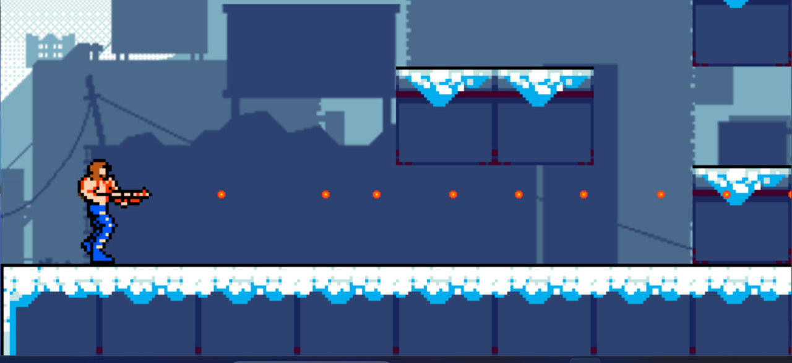
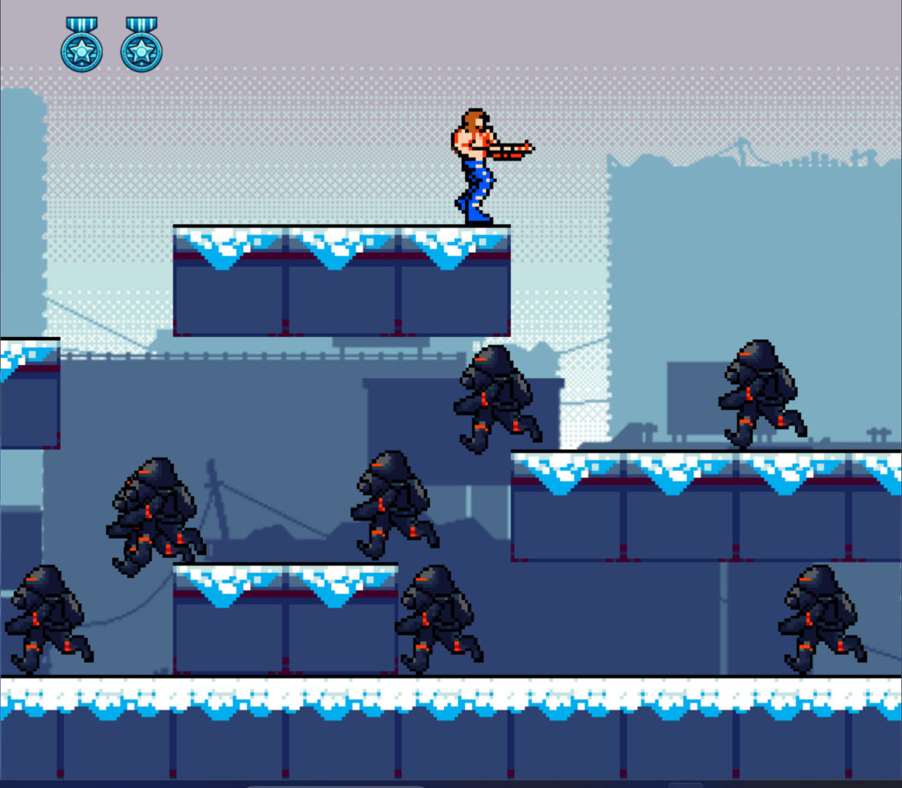
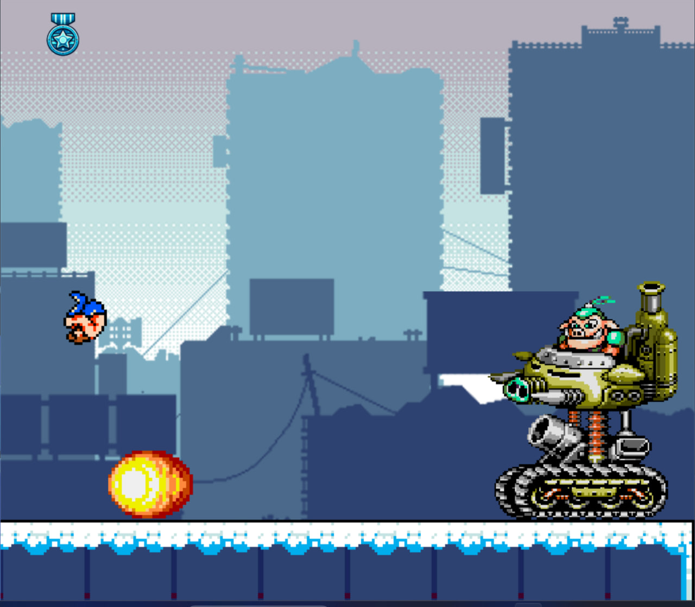
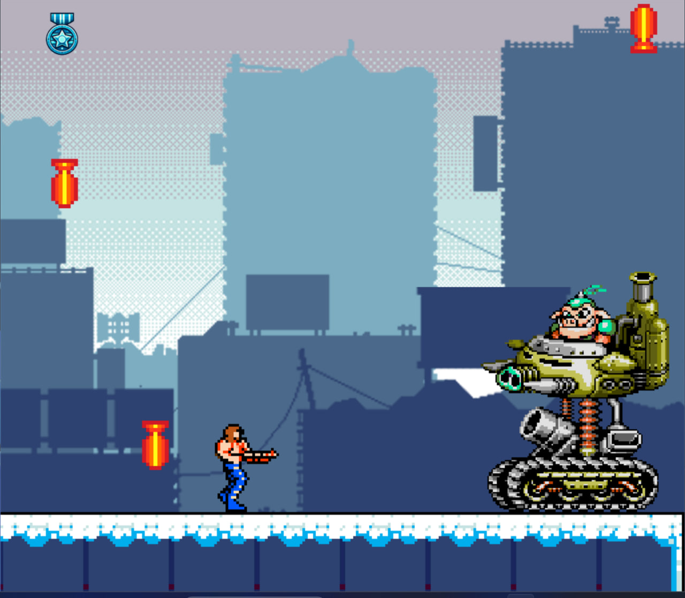

# 🎮 ContraClone-SDL2

2D-игра в жанре **платформер**, вдохновлённая классической **Contra** (Dendy). Проект реализован на **C++** с использованием библиотеки **SDL2** в рамках курсовой работы.

---

## 🧩 Описание проекта

Игра представляет собой однопользовательский платформер, в котором игроку предстоит пройти через уровень, сражаясь с врагами и боссом. Использованы основные механики жанра: прыжки, стрельба в 8 направлениях, управление персонажем, прокрутка карты, параллакс-эффект, система коллизий, сохранение и загрузка прогресса.

---

## 📸 Скриншоты

### Главное меню


### Стрельба персонажа


### Появление врагов


### Битва с боссом – стадия 1


### Битва с боссом – стадия 2


---

## 🚀 Основные возможности

- Управление движением, прыжками, стрельбой, уклонениями
- Поддержка стрельбы в 8 направлениях
- Случайный спавн врагов, которые атакуют игрока
- Финальный босс с **3 фазами** и уникальными паттернами атак
- Прокрутка карты с параллакс-эффектом
- Платформы и полноценная система коллизий
- Система **сохранения и загрузки** прогресса
- Экраны победы и поражения с переходом в меню
- Снежный визуальный стиль и анимации

---

## 🛠️ Технологии

- Язык программирования: **C++**
- Графическая библиотека: **SDL2**
- Архитектура проекта: `.h` и `.cpp` файлы (~2000 строк кода)
- IDE: **Visual Studio**

---

## 💾 Сохранение и загрузка

Прогресс игры сохраняется в текстовый файл, который содержит всю необходимую информацию:
- Координаты игрока и врагов
- Положение камеры
- Статус босса и его здоровье

Пример содержимого файла сохранения:
```txt
Player 1 404 332 180 180 1 0 0 0 33651 -6 0
EnemyRun 158 588 180 180 205
Boss 25 9979 454 236 314 1 1000
```

---

## 🚀 Как запустить проект

1. Склонируйте репозиторий:
```bash
git clone https://github.com/CTTAPTAH/ContraClone_SDL2.git```
2. Откройте .sln файл в Visual Studio.
3. Убедитесь, что установлены библиотеки: SDL2, SDL2_image, SDL2_mixer, SDL2_ttf
4. Постройте и запустите проект (F5).

---

## 📄 Лицензия

Проект распространяется под лицензией MIT. Вы можете свободно использовать, копировать, модифицировать и распространять данный код в любых целях при условии сохранения оригинальной лицензии.
